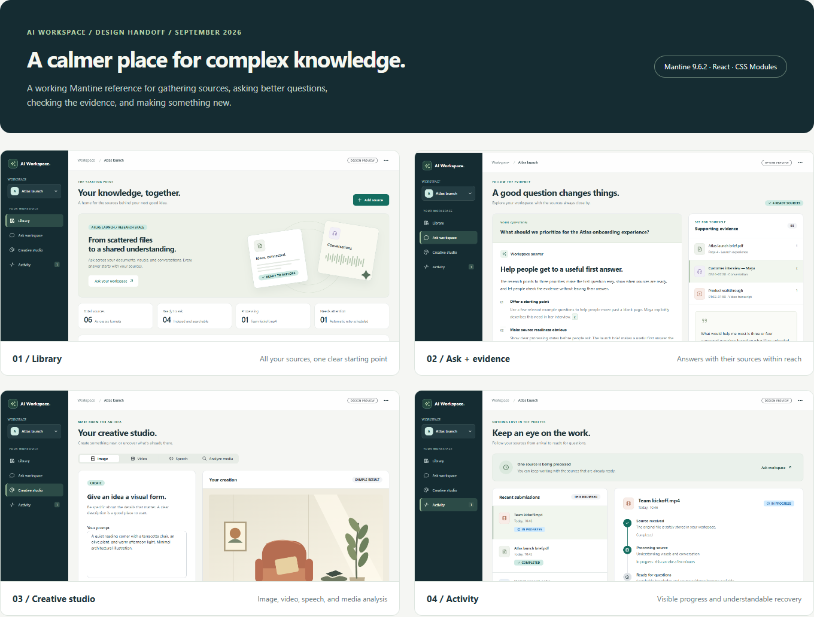

# ai-workspace

AI Workspace brings documents, web pages, audio, and video into one searchable
workspace. It lets users ask questions with supporting evidence and create
images, video, and speech. The application combines a React/Mantine interface
with a modular Spring Boot API.

## Interface preview



*Design preview with sample data. The React application follows this design.*

[Library](docs/design/mantine-workspace/screenshots/01-library-desktop.png) ·
[Ask with evidence](docs/design/mantine-workspace/screenshots/06-ask-desktop.png) ·
[Creative studio](docs/design/mantine-workspace/screenshots/10-studio-image.png) ·
[Activity](docs/design/mantine-workspace/screenshots/15-activity-desktop.png)

## Structure

- `apps` - Gradle multi-module root for application code
- `apps/api` - main executable Spring Boot API subproject
- `apps/shared` - shared data model library subproject
- `apps/documents` - document business logic subproject
- `apps/images` - image business logic subproject
- `apps/videos` - video business logic subproject
- `apps/audio` - audio business logic subproject
- `apps/knowledge` - knowledge and workspace retrieval business logic subproject
- `apps/orchestrator` - async multimodal orchestration subproject
- `apps/workspaces` - workspace metadata business logic subproject
- `docs` - architecture notes, API notes, and project documentation
- `infra` - server/service configuration, SQL, and deployment assets
- `infra/docker/whisper` - optional Docker setup for local Whisper speech-to-text
- `infra/docker/piper` - optional Docker setup for local Piper text-to-speech
- `scripts` - helper scripts for local operations and deployment
- `data` - local sample data and exports

## Build

Run application build commands from `apps`:

```bash
cd apps
./gradlew test
```

## Web application

The API serves the Mantine-based React application from `/` when Spring Boot is
running. The Library, Ask, Studio, and Activity views use the existing authenticated
API. Library's Add sources dialog handles file uploads, public web pages, and
YouTube URLs; background ingestion jobs appear in Activity. Source details show
metadata and recovery diagnostics, while Ask displays answers beside their
supporting passages. Generated media can be previewed and downloaded in Studio.

For frontend development, run `npm ci`, `npm test`, `npm run typecheck`, and `npm run dev` from
`apps/web`; Vite proxies API requests to `127.0.0.1:8080`. The Spring Boot
`bootJar` build embeds the frontend production build.

```bash
open http://localhost:8080/
```

## Security

The API uses stateless HTTP Basic authentication. The browser keeps credentials
in memory only, clears them after an authenticated 401, and the server does not
create an HTTP session. Production must
serve the application through TLS; set `SECURITY_REQUIRE_HTTPS=true` after the
reverse proxy is configured to forward the original scheme correctly.

New passwords must contain 12 or more characters and fit within BCrypt's
72-byte UTF-8 input limit. BCrypt work factor defaults to 12 and can be changed
with `SECURITY_BCRYPT_STRENGTH`.

Per-client fixed-window API limits default to 300 requests per minute, with a
separate limit of 10 registration requests per minute. Configure them through
`SECURITY_RATE_LIMIT_REQUESTS_PER_MINUTE` and
`SECURITY_REGISTRATION_RATE_LIMIT_REQUESTS_PER_MINUTE`; rejected requests return
HTTP 429 with `Retry-After`. The current limiter is process-local, so multi-node
deployments must enforce a shared limit at the gateway or replace it with a
distributed implementation.

PostgreSQL-backed per-user daily quotas default to 100 ingestion requests, 500
answers, and 25 media generations. Configure `USER_QUOTA_ENABLED`,
`USER_INGESTIONS_PER_DAY`, `USER_ANSWERS_PER_DAY`, and
`USER_GENERATIONS_PER_DAY`. The quota window resets at 00:00 UTC. Rejected
requests return HTTP 429 with `Retry-After`; unsuccessful requests and repeated
submissions also consume quota. HTTP Basic remains an MVP authentication model;
use a managed identity provider before exposing sensitive production data.

Authentication failures, rejected authenticated resource access, mutations, and
rate-limit events are written to the `SECURITY_AUDIT` logger. Actor and client
identities are SHA-256 fingerprints; credentials, email addresses, request
bodies, and query strings are not logged. Production deployments should route
this logger to retained, access-controlled audit storage.

## Documents

Document uploads support **TXT (plain text), PDF, DOC/DOCX, XLS/XLSX, and PPT/PPTX**.
The server detects the format from file contents; a filename or declared MIME
type does not grant support. Macro-enabled OOXML files,
images, HTML uploads, and generic archives are not supported document formats.
Web-page imports remain available through `/api/v1/documents/web-page`. They
respect the charset declared by the origin server and HTML metadata, handle
plain-text responses without HTML parsing, and prefer `article`, `main`, or
`role=main` content. Navigation, forms, and content outside the selected region
are excluded; page-level headers and footers are also removed when body fallback
is needed. Headings, paragraphs, lists, and table rows retain readable
boundaries. The complete extracted text is stored; `storedCharacterCount` and
the compatibility `loggedCharacterCount` field therefore match
`characterCount`, and `truncated` is false.

Extraction preserves ordered text blocks instead of reducing every file to an
undifferentiated string. Blocks identify headings, paragraphs, list items, and
table rows. PDF blocks carry page numbers, presentation blocks carry slide
numbers, and spreadsheet rows carry sheet names. The knowledge text includes
page, slide, and sheet markers so the existing search pipeline retains those
locations. DOCX headings and tables are read through Apache POI; Word page
numbers are unavailable because DOCX stores document flow rather than rendered
page layout.

Direct uploads to `/api/v1/documents/text` return the usual API error response
with an additional stable `code` for document failures:

| Code | HTTP status | Action |
| --- | --- | --- |
| `EMPTY_DOCUMENT` | 400 | Select a nonempty file. |
| `UNSUPPORTED_DOCUMENT_FORMAT` | 415 | Export to a supported format. |
| `PASSWORD_PROTECTED_DOCUMENT` | 422 | Upload an unencrypted copy. |
| `CORRUPT_DOCUMENT` | 422 | Check the original file or export it again. |
| `EXTRACTION_LIMIT_EXCEEDED` | 422 | Split the document into smaller files. |
| `NO_EXTRACTABLE_TEXT` | 422 | Supply a document containing selectable text. |

PDF pages without readable text are rendered by `documents` and transcribed
through the dedicated `ImageOcrProvider` interface in `images`. The current
provider uses Gemini and requires `GEMINI_API_KEY`. Existing text pages are
preserved; OCR text is merged in page order before chunking. Pages with even a
partial readable text layer are currently left unchanged.

OCR is enabled by default (`DOCUMENT_OCR_ENABLED`). Limits default to 50 OCR
pages per document (`DOCUMENT_OCR_MAX_PAGES`), 150 DPI (`DOCUMENT_OCR_DPI`), and
4 million pixels per rendered page (`DOCUMENT_OCR_MAX_PIXELS`). The model is
configured by `IMAGE_OCR_MODEL`. Existing character and block limits also apply.
Provider errors or truncated responses fail ingestion rather than index partial
results. Blank OCR output is allowed; a completely textless document still fails.
The OCR contract allows optional region confidence and normalized coordinates;
the current Gemini adapter returns neither, rather than inventing them.
Sources that fail extraction remain visible with status `FAILED`, including
empty uploads, and
their content is not added to workspace knowledge. Async ingestion steps expose
the same failure code in `errorCode` alongside a readable `errorMessage`.
An explicitly attached empty document is rejected with `EMPTY_DOCUMENT` after
its source record is created and marked failed; an unselected optional document
field is still skipped and creates no source.

Flyway migration `V5` adds the nullable `ingestion_job_steps.error_code` column;
existing ingestion records retain a null code.

Extraction is bounded independently of the 25 MB upload limit. By default, a
document may produce at most 1,000,000 text characters, PDF random-access
output may contain at most 10,000 structural blocks, PDF random-access buffering
spills to temporary storage after 64 MiB, and embedded attachments are ignored.
Search chunks target five complete sentences. Sentences are never cut to meet a character limit; explicit chapter/section headings and paragraph breaks are preserved.
The PDF threshold does not cap every JVM allocation made by a parser. Configure
these controls with:

```properties
ai-workspace.documents.extraction.max-extracted-characters=1000000
ai-workspace.documents.extraction.max-extracted-blocks=10000
ai-workspace.documents.extraction.max-pdf-main-memory-bytes=67108864
ai-workspace.documents.extraction.extract-embedded-documents=false
ai-workspace.documents.extraction.max-chunk-sentences=5
```

Every imported item now has a durable source identity. Uploaded files, web pages,
and YouTube URLs are registered before processing and retain either stored-file
metadata or their canonical URL. Knowledge items also store the extraction completion time and the versioned
parser identifier. Direct import responses return this metadata, and asynchronous
ingestion submissions return workspace file IDs in `sourceIds`, keyed by content
type. This makes same-named files distinguishable and provides the metadata needed
for deletion, reprocessing, and traceable citations. All ingestion entry points
use the same lifecycle: `UPLOADED` → `PROCESSING` → `PROCESSED` or `FAILED`.
List sources with `GET /api/v1/workspaces/{workspaceId}/sources`, reprocess one
with `POST /api/v1/workspaces/{workspaceId}/sources/{sourceId}/reprocess`, and
delete it together with indexed knowledge using the corresponding `DELETE` path.

Source processing and deletion are backed by a durable PostgreSQL recovery
ledger. Asynchronous submissions persist a pending recovery task with their job
before worker dispatch, so a queued source can resume after a restart. Workers
queue source IDs and load uploaded bytes from storage when processing begins.
The bounded worker queue defers excess work to the recovery scheduler. Transient
provider, OpenSearch, and storage failures are retried with
bounded exponential backoff; permanent failures and exhausted retries move to
`DEAD_LETTER` with a bounded error code and message. Expired processing leases
make interrupted work recoverable after restart. Completed sources are also
reconciled periodically against file storage and OpenSearch: missing index data
is reprocessed, missing stored bytes are surfaced as an integrity failure, and
orphaned knowledge is removed. Inspect a source with
`GET /api/v1/workspaces/{workspaceId}/sources/{sourceId}/recovery`; the Library
source details show the same state, attempt count, next check, and last error.

Recovery is enabled by default. Its retry count, backoff, lease, reconciliation,
polling, and batch settings are configured through the `SOURCE_RECOVERY_*` and
`SOURCE_RECONCILIATION_INTERVAL` variables documented in `.env.example`.
`INGESTION_WORKER_THREADS` and `INGESTION_QUEUE_CAPACITY` bound local dispatch.

Recovery claims have per-attempt fencing tokens and renewable leases, including
while a recovered job waits in the worker queue. A stale worker cannot publish a
completed generation or change the source/job state after losing its lease.
OpenSearch writes stage a new source generation first and verify its exact item
count. Only then does the database transaction publish the active generation
with the completed source and job; readers ignore unpublished generations.
Old generations are pruned after publication and by later reconciliation.

Async ingestion and source reprocessing accept an `Idempotency-Key` header.
Retry the same payload with the same key to receive the original submission;
reusing the key with different input returns a conflict. Keys expire after 30
days. Synchronous direct media endpoints do not currently use this key.
`GET /api/v1/orchestrator/jobs?workspaceId=...` returns recent persisted jobs,
and `GET /api/v1/knowledge/workspaces/{workspaceId}/answers` returns saved
question-and-answer history. The Activity and Ask views load these server-side
records, so navigation and reload no longer lose them.

Each API response includes `X-Request-ID`, which is included in server logs.
Authenticated `/actuator/metrics` exposes ingestion attempts, recovery
transitions, worker activity, and queue depth. Keep metrics behind the same
trusted access boundary as the API.

## Local Whisper

Whisper is optional supporting infrastructure for the `audio` module. Start it with Docker:

```bash
docker compose -f infra/docker/whisper/compose.yml up -d
```

The service listens on `http://localhost:9000` by default.
Audio transcription requests ask Whisper for detailed JSON and word timestamps.
Responses expose a full transcript, detected language, and timed segments. Speaker
labels remain empty with the default `faster_whisper` engine; they are populated
only when a configured provider performs diarization.
Workspace ingestion indexes each non-empty transcript segment as an independently
searchable knowledge chunk. Each chunk keeps its source file ID, sequence, start
and end time, and optional speaker so answer evidence can identify the matching
audio passage. Provider responses without segments fall back to one untimed chunk.

## Local Piper

Piper is optional supporting infrastructure for text-to-speech. Start it with Docker:

```bash
docker compose -f infra/docker/piper/compose.yml up -d
```

The service listens on Wyoming protocol port `10200` by default.

## Knowledge

Create a workspace:

```bash
curl -X POST http://localhost:8080/api/v1/workspaces \
  -H 'Content-Type: application/json' \
  -d '{"name":"Investor demo workspace"}'
```

List workspaces:

```bash
curl http://localhost:8080/api/v1/workspaces
```

Get one workspace:

```bash
curl http://localhost:8080/api/v1/workspaces/{workspaceId}
```

The `knowledge` module reads workspace knowledge from OpenSearch. Configure
`OPENSEARCH_URL` if OpenSearch is not available at `http://localhost:9200`.

The API creates the vector-enabled `knowledge-items-v3` index on first access if
it does not exist. Each extracted result is stored as a separate knowledge item with
`workspaceId`, `sourceType`, `sourceName`, `sourceId`, optional `sourceUrl`,
`jobId`, `content`, `extractedAt`, `parserVersion`, chunk identity and sequence,
optional heading and source location, `embedding`, `embeddingModel`,
`embeddingDimensions`, `contentHash`, and `createdAt`.

Document and web content is indexed as bounded, structure-aware chunks rather
than one OpenSearch record per source. Each chunk retains its source ID,
sequence, current heading, and page, slide, or sheet location where available.
Each chunk receives one normalized, 768-dimensional embedding generated inside
the application by Spring AI and the pinned `intfloat/multilingual-e5-base`
ONNX model. Document chunks use the model's `passage:` prefix and questions use
its `query:` prefix. By default, search combines BM25 matches over chunk content and headings with
OpenSearch kNN results using reciprocal rank fusion. Query expansion is enabled by
default: the original question and up to two rewrites are searched. Rewrites focus
on the named entity and requested attribute, preserve disambiguating qualifiers in
a second formulation, and are instructed not to guess answer values. All result
lists are deduplicated and combined using reciprocal rank fusion before selection.
`KNOWLEDGE_SEARCH_CANDIDATE_LIMIT` defaults to 100 candidates per retrieval stream,
independently of the final context limit and whether reranking is enabled.
`KNOWLEDGE_SEARCH_RRF_RANK_CONSTANT` defaults to 30, giving top positions more
weight than the previous value of 60 when combining these deeper result lists.
Set `KNOWLEDGE_SEARCH_MODE=VECTOR` to use only the kNN result lists.
In either mode, the twelve highest-ranked
chunks are selected, then the next chunk is fetched within the same
source and section. Overlapping windows are deduplicated while preserving search
rank, with each following chunk placed after its seed, producing at most 24 evidence chunks. Search falls back to BM25 when
query embedding generation is unavailable. Document ingestion fails before
indexing when the required local embedding model cannot generate every vector.

`KNOWLEDGE_QUERY_EXPANSION_ENABLED=false` searches only the original question.
`KNOWLEDGE_QUERY_EXPANSION_LIMIT` controls the number of rewrites (default 2).
Optional reranking remains disabled by default. When enabled, its candidate limit
controls how many fused results are scored; each search retrieves at least that
many candidates. A larger retrieval pool increases search work and response bytes,
while the answer context remains bounded at 24 chunks including following chunks.

Reprocessing the same document source replaces its complete chunk set. Obsolete
chunk IDs are pruned only after OpenSearch accepts the replacement bulk request,
and a retry converges on the complete current set. Deleting a stored document
first removes its source-scoped knowledge from OpenSearch and then deletes the
stored file; if knowledge cleanup fails, the file remains available for retry.
Deleting a workspace performs the same cleanup for all of its OpenSearch
knowledge and stored files before removing the workspace metadata.

Embedding defaults are configurable with `KNOWLEDGE_EMBEDDING_MODEL`,
`KNOWLEDGE_EMBEDDING_DIMENSIONS`, `KNOWLEDGE_EMBEDDING_BATCH_SIZE`,
`KNOWLEDGE_SEARCH_CANDIDATE_LIMIT`, and
`KNOWLEDGE_SEARCH_RRF_RANK_CONSTANT`. Changing embedding dimensions requires a
new vector index and re-ingestion because OpenSearch vector dimensions are part
of the index mapping. The pinned ONNX model and tokenizer are downloaded once
and cached under `KNOWLEDGE_EMBEDDING_CACHE_DIRECTORY`; together they require
about 1.13 GB. Their URIs can point to pre-provisioned `file:` resources. Fully
offline installations must also pre-provision DJL's platform-native runtime
cache. This embedding change uses the `knowledge-items-v3` index because an
existing OpenSearch vector field cannot change from 384 to 768 dimensions.
Gemini is used for answer generation and does not create embeddings.

Text produced by document parsing/web extraction, timed audio transcription,
image description, and structured video analysis is attached to the selected
workspace. Video knowledge keeps the visual summary separate from spoken content
and includes timestamps and provider-supplied speaker labels when available.
Newly ingested audio is searchable by transcript passage and returns timing and
speaker metadata in answer sources. Existing audio sources require re-ingestion
to receive the chunked representation.

```bash
curl http://localhost:8080/api/v1/knowledge/workspaces/{workspaceId}
```

Ask a question against a workspace context:

```bash
curl -X POST http://localhost:8080/api/v1/knowledge/workspaces/{workspaceId}/answers \
  -H 'Content-Type: application/json' \
  -d '{"question":"What do we know about this workspace?"}'
```

Run async multimodal ingestion:

```bash
curl -X POST http://localhost:8080/api/v1/orchestrator/ingestions \
  -F "workspaceId={workspaceId}" \
  -F "document=@/path/to/document.txt" \
  -F "audio=@/path/to/audio.mp3" \
  -F "image=@/path/to/image.png" \
  -F "video=@/path/to/video.mp4"
```

The endpoint returns `202 Accepted` with an ingestion `jobId`. Check async
processing status with:

```bash
curl http://localhost:8080/api/v1/orchestrator/jobs/{jobId}
```

## Image Descriptions

The `images` module can describe uploaded images through Gemini. Configure `GEMINI_API_KEY`
before starting the API.

```bash
curl -X POST http://localhost:8080/api/v1/images/descriptions \
  -F "workspaceId={workspaceId}" \
  -F "file=@/path/to/image.png"
```

The `images` module can also generate images through FLUX.1 Dev. Configure
`HUGGING_FACE_API_TOKEN` before starting the API.

```bash
curl -X POST http://localhost:8080/api/v1/images/generations \
  -H 'Content-Type: application/json' \
  -d '{"description":"A small cabin in a snowy forest at sunrise."}' \
  --output generated-image.png
```

## Video Analysis

The `videos` module returns a visual summary, detected spoken language, verbatim
transcript, and timed transcript segments through Gemini. Videos without speech
return an empty transcript and segment list. Configure `GEMINI_API_KEY` before
starting the API.

```bash
curl -X POST http://localhost:8080/api/v1/videos/descriptions \
  -F "workspaceId={workspaceId}" \
  -F "file=@/path/to/video.mp4"
```

Public YouTube videos can be imported directly without downloading or storing
their source bytes. Standard watch, share, Shorts, embed, and live URLs are
canonicalized to one video URL before being sent to Gemini. Private, unlisted,
playlist-only, non-YouTube, and non-HTTPS URLs are rejected.

```bash
curl -X POST http://localhost:8080/api/v1/videos/youtube \
  -H 'Content-Type: application/json' \
  -d '{"workspaceId":"{workspaceId}","url":"https://www.youtube.com/watch?v=9hE5-98ZeCg"}'
```

The response includes a durable `sourceId`; the canonical YouTube URL is retained
as source metadata for workspace citations. Gemini's direct YouTube input is a
preview capability and currently supports public videos only. This first version
processes the URL synchronously and uses the shared outbound HTTP read timeout;
long videos may require a larger `ai-workspace.http.read-timeout` or a future
asynchronous provider workflow.

The `videos` module can also generate videos through Google Veo. Configure
`GEMINI_API_KEY` before starting the API.

```bash
curl -X POST http://localhost:8080/api/v1/videos/generations \
  -H 'Content-Type: application/json' \
  -d '{"description":"A cinematic shot of a mountain lake at sunrise."}' \
  --output generated-video.mp4
```

For a local Docker OpenSearch instance and disposable real-server integration
tests, see [the OpenSearch setup](infra/docker/opensearch/README.md).


Long chunks remain intact in storage. For the local E5 model, all input text is
processed in token-checked windows of at most 512 tokens (including the prefix
and special tokens). Window vectors are averaged and normalized into one vector
per stored chunk; no input is silently truncated. This pooling preserves text
coverage but may dilute specific details in unusually long chunks.

Sentence boundaries use the JDK English sentence iterator with common honorific
and initial handling. Heading detection honors parser headings and conservative
plain-text/Markdown chapter markers; arbitrary prose is not a reliably inferred
section. Old indexed content must be re-ingested to obtain sentence chunks and
section IDs. Items without section metadata remain searchable but do not receive
neighbor expansion.
