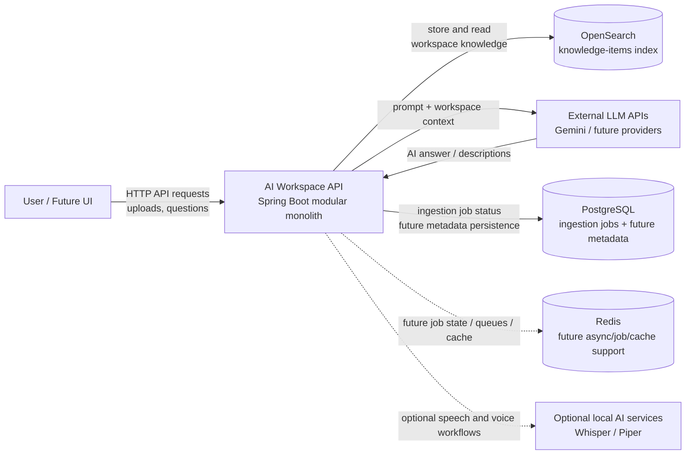
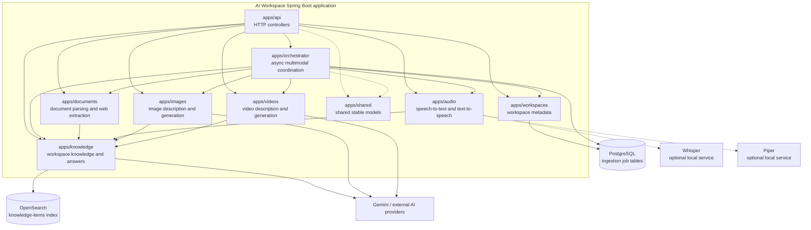
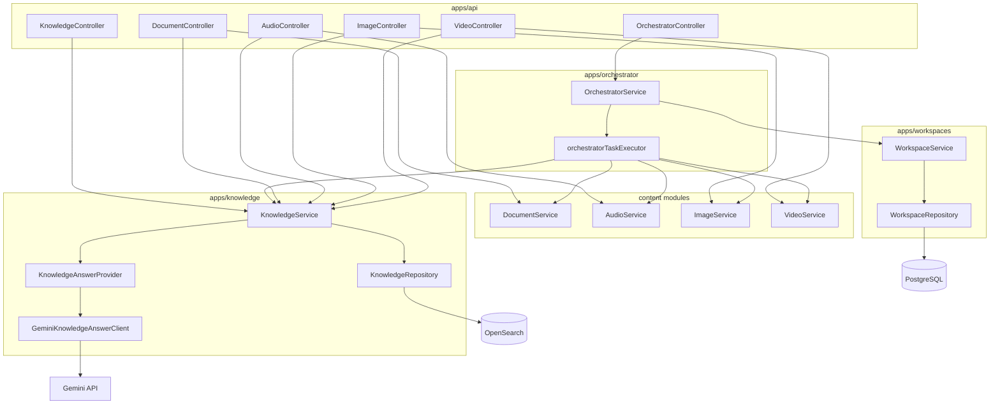
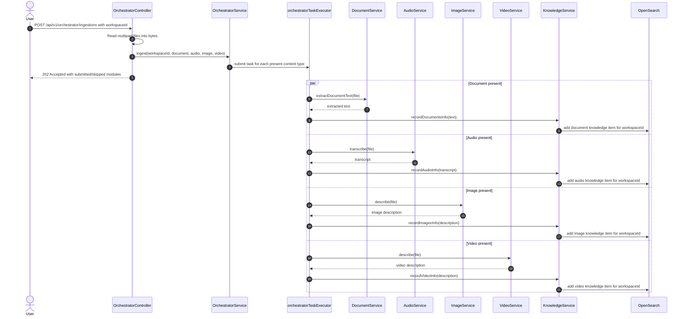
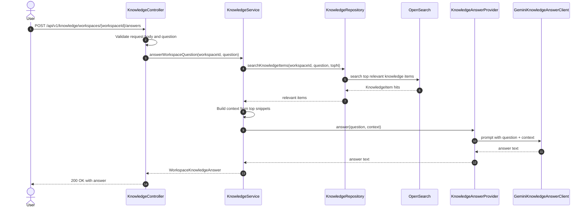
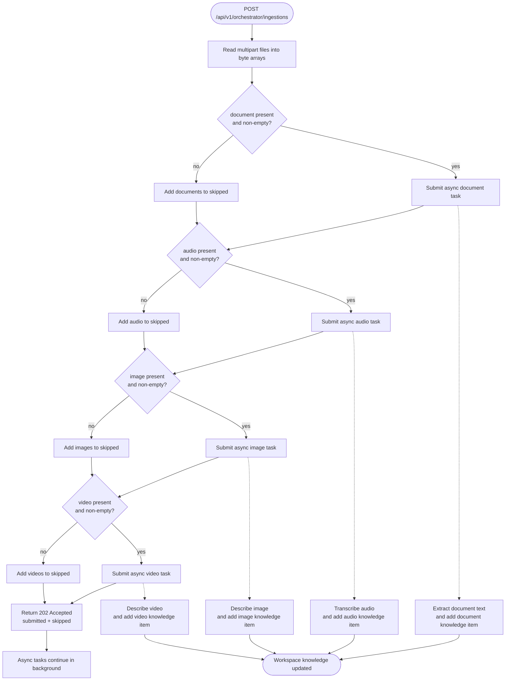
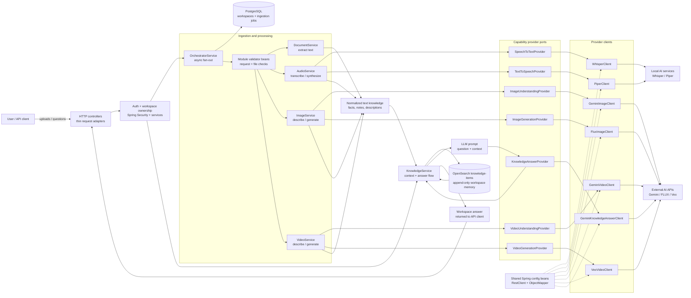

# Architecture Diagrams

This file documents the current AI Workspace architecture and core workflows.
The diagrams use Mermaid so they can be rendered directly by GitHub and most
Markdown tooling.

## 1. System Context

This diagram shows AI Workspace as a product boundary and the external systems
it depends on.

## 2. Container Architecture

This diagram shows the main modules inside the current modular monolith.

## 3. Component Diagram

This diagram shows the main components involved in the orchestrator and
knowledge flows.

## 4. Sequence Diagrams

### Multimodal Ingestion

This diagram shows the current orchestrator upload flow. The endpoint accepts
any combination of document, audio, image, and video files. Missing or empty
content types are skipped.

### Ask Workspace

This diagram shows how the workspace question endpoint retrieves workspace
knowledge, builds context, calls an LLM, and returns the answer.

## 5. Workflow Flowchart

This diagram shows the decision logic inside the multimodal ingestion workflow.

## 6. Data Flow

This diagram shows how messy multimodal input becomes workspace memory and then
LLM-ready context. Domain services validate input through module-local validator
beans, then call provider interfaces instead of concrete AI clients directly.

