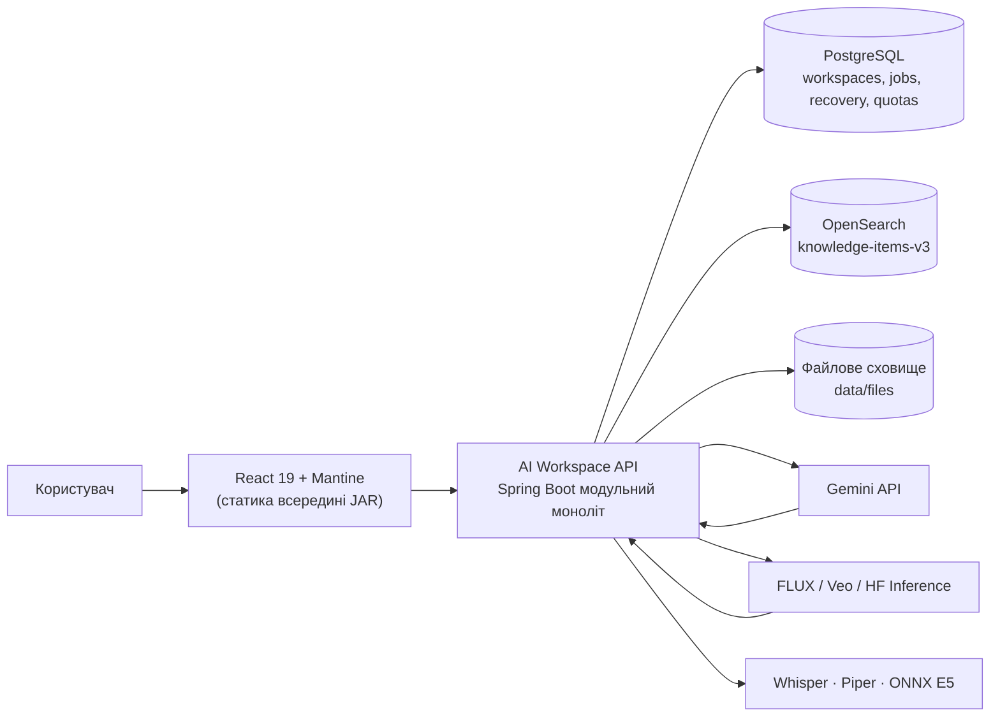
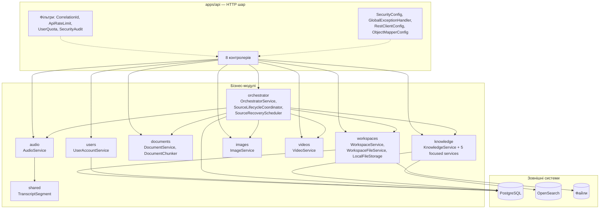
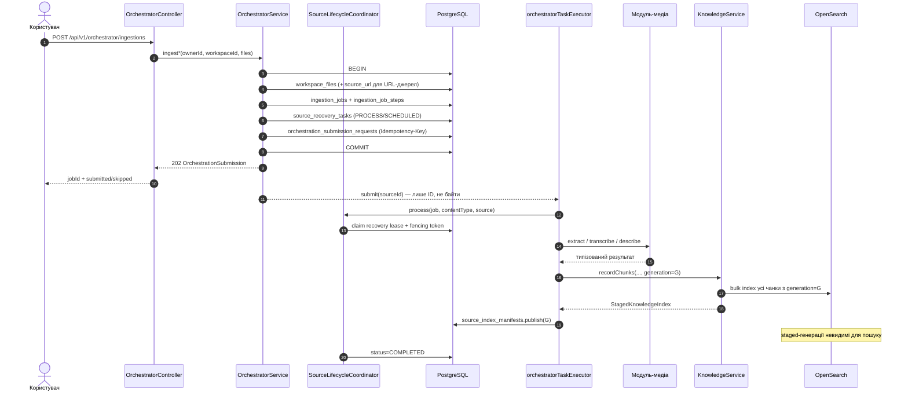
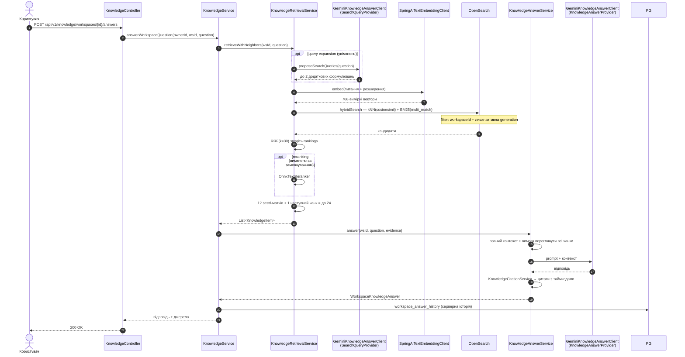
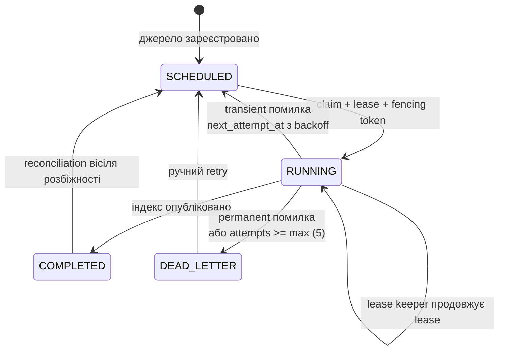

# Повна архітектура AI Workspace

Детальний опис системи: модулі, потоки даних, схема БД, контракти API, інфраструктура.

Цей документ описує **поточний стан репозиторію** (`develop`, останній коміт `2ff47eb`) на основі реального коду, а не лише проєктних записів. Для намірів та обґрунтувань дивіться `docs/agent-context/architecture.md`, `docs/architecture-diagrams.md` та ADR у `docs/adr/`.

---

## 1. Огляд

AI Workspace — мультимодальна RAG-платформа. Користувач створює workspace, завантажує документи, аудіо, зображення, відео або дає URL веб-сторінки чи YouTube. Система витягує знання, індексує його у векторному пошуку, і далі відповідає на запитання з доказовою базою (цитатами на рівні чанків).

### Ключові характеристики

| Аспект | Реалізація |
|---|---|
| Стиль архітектури | Модульний моноліт (ADR 0001) |
| Точка входу | Один Spring Boot додаток `apps/api` |
| Стан | PostgreSQL + OpenSearch + файлове сховище |
| Асинхронність | Власний пул воркерів + durable ledger відновлення |
| Ідемпотентність | Версіонування індексів, fencing-токени, `Idempotency-Key` |
| Пошук | Hybrid (kNN + BM25) з RRF, query expansion, розширення сусідів |
| Спільна відповідь | Цитати з таймкодами для аудіо/відео |

### Технологічний стек

**Backend:** Java 25 (toolchain), Spring Boot 4.1.1, Spring AI 2.0.1, Spring Data JPA, Flyway, Spring Security, Micrometer, Gradle 9 multi-module, MapStruct 1.6.3, Lombok 1.18.42.

**Frontend:** React 19.3, Vite 8.3, Mantine 9.6, Tabler Icons, Vitest 5, Testing Library, TypeScript 5.9 (JSDoc-checked).

**Сховища:** PostgreSQL, OpenSearch 3.8 (індекс `knowledge-items-v3`), локальне файлове сховище.

**Зовнішні провайдери:** Gemini (текст/зображення/відео/OCR/answers), FLUX (генерація зображень), Veo (генерація відео), Hugging Face Inference.

**Локальні сервіси:** Whisper (STT), Piper (TTS), локальний ONNX E5 (ембеддінги), локальний ONNX cross-encoder (reranking, вимкнено).

**Обробка документів:** Apache Tika 3.2, PDFBox 3.0.5, Apache POI, Jsoup 1.18.3.

---

## 2. Структура репозиторію

```text
D:\ai-workspace
├── apps/                          Gradle root (відкривати в IntelliJ IDEA)
│   ├── settings.gradle            10 модулів
│   ├── build.gradle               Java 25 toolchain, verifyModuleBoundaries
│   ├── api/                       виконуваний Spring Boot застосунок
│   ├── shared/                    спільні моделі (TranscriptSegment, UpstreamServiceException)
│   ├── documents/                 парсинг документів, веб-сторінки, OCR-fallback
│   ├── audio/                     Whisper / Piper
│   ├── images/                    Gemini / FLUX, OCR-провайдер
│   ├── videos/                    Gemini / Veo, YouTube
│   ├── knowledge/                 OpenSearch, ембеддінги, пошук, відповіді
│   ├── orchestrator/              асинхронна оркестрація, durable recovery
│   ├── users/                     акаунти, ownership
│   ├── workspaces/                workspace-метадані, сховище файлів
│   └── web/                       React + Vite + Mantine
├── docs/
│   ├── agent-context/             довготривала пам'ять проєкту для агентів
│   ├── adr/                       9 ADR (0001-0010)
│   ├── design/mantine-workspace/  дизайн-прототип
│   ├── evaluations/               результати оцінки retrieval
│   ├── architecture-diagrams.md   існуючі Mermaid-діаграми
│   └── end-to-end-test-specification.md
├── infra/docker/                  opensearch, whisper, piper (compose + README)
├── infra/nginx|sql|systemd/       порожні заготки (під майбутнє)
├── .github/workflows/ci.yml       CI
├── .env.example                   документований конфіг без секретів
├── AGENTS.md                      інструкції для AI-агентів
└── DEVELOPER_CODE_PREFERENCES.md  ваші особисті вподобання
```

### Правило меж модулів

`apps/build.gradle` містить задачу `verifyModuleBoundaries`, яка **падає на білді**, якщо:

1. модуль імпортує заборонений модуль;
2. у бізнес-модулі (`!= api`) з'явиться `*Controller.java`.

Дозволені залежності:

```text
api          → shared, documents, images, videos, audio, knowledge,
               orchestrator, users, workspaces
knowledge    → shared, workspaces
orchestrator → shared, audio, documents, images, videos, knowledge, workspaces
documents    → shared, images, knowledge
audio        → shared, knowledge
images       → shared
videos       → shared
users        → (немає)
workspaces   → (немає)
shared       → (немає)
```

Це робить майбутній поділ на мікросервіси механічним: кожен майбутній сервіс відповідає одному наявному модулю.

---

## 3. Діаграми

### 3.1 System Context



### 3.2 Container Architecture



### 3.3 Потік інгестії (asynchronous, durable)



Ключові гарантії з цієї послідовності:

- Job, кроки й recovery-рядки створюються **в одній транзакції** до dispatch — після рестарту scheduler підхопить роботу.
- Воркер черги **ID джерел**, а не байти; вміст читається зі сховища в момент виконання.
- `generation` пишеться в кожен документ індексу; `source_index_manifests` перемикає активну версію транзакційно.
- Fencing-токен не дає застарілому воркеру закомітити результат.

### 3.4 Потік відповіді (RAG)



### 3.5 Відновлення та Reconciliation



`SourceRecoveryScheduler` працює за двома таймерами:

| Таймер | Інтервал (за замовчуванням) | Призначення |
|---|---|---|
| poll | 30s | claimed-izadoвна робота: due або lease-expired |
| reconciliation | 6h | звіряє завершені джерела з файловим сховищем і OpenSearch |

Reconciliation перевіряє: чи є байти у сховищі, чи є active generation в індексі, чи збігається `expected_items`. За розбіжності — переіндексація, повідомлення про відсутні байти або прибирання «осиротілих» knowledge item.

Керується через:

```properties
ai-workspace.orchestrator.recovery.max-attempts=5
ai-workspace.orchestrator.recovery.initial-backoff=30s
ai-workspace.orchestrator.recovery.max-backoff=15m
ai-workspace.orchestrator.recovery.lease-duration=30m
ai-workspace.orchestrator.recovery.reconciliation-interval=6h
ai-workspace.orchestrator.recovery.poll-interval=30s
ai-workspace.orchestrator.recovery.batch-size=50
ai-workspace.orchestrator.executor.threads=4
ai-workspace.orchestrator.executor.queue-capacity=100
```

---

## 4. Модулі

### `apps/api` — HTTP шар

Тільки адаптація запитів/відповідей, без бізнес-логіки.

```text
com.aiworkspace
├── AiWorkspaceApplication
├── config/
│   ├── SecurityConfig, SecurityProperties
│   ├── GlobalExceptionHandler
│   ├── RestClientConfig, HttpClientProperties
│   ├── ObjectMapperConfig
│   └── EmbeddingWindowConfig
├── controllers/
│   ├── AuthController            /api/v1/auth
│   ├── WorkspaceController       /api/v1/workspaces
│   ├── OrchestratorController    /api/v1/orchestrator
│   ├── KnowledgeController       /api/v1/knowledge
│   ├── DocumentController        /api/v1/documents
│   ├── AudioController           /api/v1/audio
│   ├── ImageController           /api/v1/images
│   └── VideoController           /api/v1/videos
├── models/ApiErrorResponse
└── security/
    ├── CorrelationIdFilter, SecurityFingerprint
    ├── ApiRateLimitFilter, InMemoryRateLimiter
    ├── UserQuotaFilter, UserQuotaService, UserQuotaUsage*
    └── SecurityAuditFilter, SecurityAuditService
```

Порядок фільтрів: кореляція ID → security → rate limit → квота → аудит.

Фронтенд збирається **всередину bootJar**: `processResources` залежить від `frontendBuild`, а `apps/web/dist` пакується в `static/`. Тому один процес Spring Boot віддає повний застосунок.

### `apps/shared`

Дві сутності — навмисно мінімально:

- `media/TranscriptSegment` — таймкодований сегмент транскрипту (ms, speaker, text)
- `exceptions/UpstreamServiceException` — єдина оболонка для помилок зовнішніх сервісів

### `apps/orchestrator` — серце системи

```text
services/
├── OrchestratorService              публічний фасад: ingest* для кожного типу
├── SourceLifecycleCoordinator       create → process → index → complete/fail
├── WorkspaceSourceProcessingService реалізація SourceProcessingOperation
├── SourceRecoveryScheduler          poll + reconciliation
├── SourceRecoveryTaskService        ledger CRUD
├── SourceRecoveryTracker            запис спроб і результатів
├── SourceLeaseKeeper                продовження lease
├── SourceRetryPolicy                exponential backoff
├── SourceCompletionService          публікація generation
├── IngestionJobService              стан job і кроків
├── OrchestrationSubmissionService   idempotency-key replay
├── WorkspaceLifecycleService         видалення workspace
├── IngestionTelemetry               Micrometer
└── OrchestratorValidator, IngestionJobValidator
```

Стан у БД: `IngestionJobEntity`, `IngestionJobStepEntity`, `SourceRecoveryTaskEntity`, `OrchestrationSubmissionRequestEntity`.

### `apps/knowledge` — пошук і відповіді

`KnowledgeService` — стабільний фасад; внутрішньо розкладається на:

| Сервіс | Відповідальність |
|---|---|
| `KnowledgeIndexingService` | генерація ембеддінгів, версіонуані записи, видалення |
| `KnowledgeRetrievalService` | query expansion, hybrid пошук, RRF, reranking, сусіди |
| `KnowledgeAnswerService` | побудова контексту, виклик провайдера |
| `KnowledgeCitationService` | форматування цитат, таймкоди, спікери |
| `SourceIndexManifestService` | публікація активної generation |
| `WorkspaceAnswerHistoryService` | серверна історія відповідей |
| `KnowledgeValidator` | валідація |
| `ReciprocalRankFusion` | RRF (статична утиліта) |
| `TokenWindowSplitter` | безпечне розбиття на токени для довгих речень |

Репозиторій розділений на співпрацівників:

```text
OpenSearchKnowledgeClient          публічний адаптер
├── OpenSearchKnowledgeSearchReader  запити читання (search, get, count)
├── OpenSearchKnowledgeIndexWriter   записи (bulk, delete, delete_by_query)
└── OpenSearchKnowledgeStore        спільне: індекс, мапінг, HTTP, десеріалізація
```

Порти провайдерів у `interfaces/`: `TextEmbeddingProvider`, `EmbeddingTextSplitter`, `TextReranker`, `SearchQueryProvider`, `KnowledgeAnswerProvider`.

### `apps/workspaces`

`WorkspaceService`, `WorkspaceFileService`, `LocalFileStorage` за портом `FileStorage`, валідатори, MapStruct-мапери. Тут живуть метадані джерел, статуси (`UPLOADED`/`PROCESSING`/`PROCESSED`/`FAILED`) і байти.

`workspace_files` універсальний: завантажені файли мають `storage_key` + `checksum_sha256`, URL-джерела — `source_url` зі nullable-полями (зміна V6).

### `apps/documents`

`DocumentService` + `DocumentChunker` (структурний чанінг), `DocxStructureExtractor`, `PdfOcrFallback`, `WebPageContentExtractor`, `DocumentStructuredTextRenderer`. Витягування через Tika, PDFBox, POI; веб-сторінки через Jsoup з обмеженнями (5 редиректів, 2 МБ, 1 млн символів, 10 тис. блоків).

### `apps/audio`, `apps/images`, `apps/videos`

Тонкі модулі: сервіс-фасад + валідатор + клієнти + порти.

| Модуль | Порти | Клієнти |
|---|---|---|
| audio | `SpeechToTextProvider`, `TextToSpeechProvider` | `WhisperClient`, `PiperClient` |
| images | `ImageUnderstandingProvider`, `ImageGenerationProvider`, `ImageOcrProvider` | `GeminiImageClient`, `FluxImageClient`, `GeminiOcrClient` |
| videos | `VideoUnderstandingProvider`, `VideoGenerationProvider`, `YouTubeVideoUnderstandingProvider` | `GeminiVideoClient`, `VeoVideoClient` |

### `apps/users`

`UserAccountService`, `UserAccountValidator`, `UserAccountEntity`, `UserAccountMapper`. BCrypt strength 12 за замовчуванням.

---

## 5. Схема даних

### PostgreSQL — 10 таблиць, 13 міграцій Flyway

```text
user_accounts ──────────┬──< workspaces (owner_id)
                         │
                         ├──< workspace_files (source_type, status)
                         │        │  storage_key, checksum_sha256  (завантаження)
                         │        │  source_url                   (URL-джерела)
                         │        │
                         │        ├──< source_recovery_tasks      (1:1 з джерелом)
                         │        │      operation_type, status, attempt_count,
                         │        │      next_attempt_at, lease_expires_at,
                         │        │      lease_token, job_id
                         │        │
                         │        └──< source_index_manifests     (1:1 з джерелом)
                         │               active_generation, expected_items
                         │
                         ├──< ingestion_jobs (workspace_id, status)
                         │        └──< ingestion_job_steps (content_type, status,
                         │                             error_code, timestamps)
                         │
                         ├──< workspace_answer_history (question, answer_json)
                         ├──< orchestration_submission_requests (idempotency)
                         └──< user_daily_quota_usage (action, window_start, consumed)
```

Детально по таблицях:

| Таблиця | Міксація | Ключові моменти |
|---|---|---|
| `user_accounts` | V3 | `email`, BCrypt hash |
| `workspaces` | V2 (+owner у V3) | унікальний індекс `(owner_id, created_at)` |
| `workspace_files` | V4 (+V6) | FK → workspaces cascade; `source_type` у V6 додано `WEB_PAGE`, `YOUTUBE` |
| `ingestion_jobs` | V1 | статус + timestamps завершення |
| `ingestion_job_steps` | V1 (+`error_code` у V5) | unique `(job_id, content_type)` |
| `source_recovery_tasks` | V7, V8, V9 | PK = `source_id`; backfill існуючих джерел у V7 |
| `source_index_manifests` | V10 | `expected_items > 0` (CHECK) |
| `orchestration_submission_requests` | V11 | `response_json` для replay; retention 30 днів |
| `workspace_answer_history` | V12 | `answer_json` |
| `user_daily_quota_usage` | V13 | ключ `(user_id, action, window_start)` |

Індекси, важливі для продуктивності: `idx_source_recovery_due (status, next_attempt_at)`, `idx_source_recovery_lease (status, lease_expires_at)`, `idx_workspace_files_workspace_deleted_at`, `idx_answer_history_workspace_created`, `idx_quota_window`.

### OpenSearch — `knowledge-items-v3`

Індекс `knn: true`, HNSW: `m=16`, `ef_construction=128`, `cosinesimil` через Lucene.

```text
id                    keyword
workspaceId           keyword          ← головний filter
sourceId              keyword          ← стабільний ID джерела
sourceGeneration      keyword          ← версія індексу
sourceType            keyword
sourceName            keyword
sourceUrl             keyword (ignore_above 2048)
jobId                 keyword
content               text
heading               text             ← вага у BM25 (за замовчуванням ×2)
chunkId               keyword
chunkSequence         integer
sectionId             keyword          ← ізоляція розширення сусідів
pageNumber            integer
slideNumber           integer
sheetName             keyword
startMilliseconds     long             ← аудіо/відео таймкод
endMilliseconds       long
speaker               keyword
extractedAt           date
parserVersion         keyword
contentHash           keyword
createdAt             date
embeddingModel        keyword
embeddingDimensions   integer
embedding             knn_vector(768)
```

Фільтр пошуку — це не просто `workspaceId`:

```text
bool.filter:
  - term: workspaceId = {wsId}
  - bool.should:
      - terms: sourceGeneration ∈ activeGenerations(manifests)   ← прямий шлях
      - bool.must_not: terms: sourceId ∈ managedSourceIds         ← legacy-джерела
    minimum_should_match: 1
```

Тобто staged-генерації невидимі для читачів, а legacy-джерела без маніфестів лишаються пошуковими.

---

## 6. Як працює знання

### Чанінг

`DocumentChunker` ріже на **повні речення** (5 за замовчуванням), зберігаючи:

- `sectionId` та `headingPath` — структурний контекст;
- абзацні межі — абзац не розривається без потреби;
- `pageNumber`, `slideNumber`, `sheetName` — локація;
- довжина речення не обмежена: надто великі речення діляться на token-safe вікна, потім вектори усереднюються і L2-нормалізуються в **один вектор на чанк**.

Для аудіо кожен непорожній таймкодований сегмент стає окремим knowledge item. Відео та YouTube зараз дають один підсумковий item.

### Ембеддінги

`intfloat/multilingual-e5-base` через Spring AI ONNX, **768 вимірів**, кеш у `data/models/spring-ai`. E5-префікси (`passage:` / `query:`), батчінг 32, L2-нормалізація, перевірка розмірності перед пошуком.

Атомність: **усі** вектори створюються до того, як чанк-сет індексується. Якщо ембеддінг запиту падає — пошук деградує до BM25.

### Пошук

```text
question
  → [опціонально] Gemini пропонує до 2 запитів
  → embed(питання + розширення)
  → для кожного: hybridSearch
        kNN(embedding, k=candidateLimit=100)
        BM25 multi_match(content^1, heading^2)
  → ReciprocalRankFusion(rankings, rankConstant=30)
  → [опціонально] cross-encoder rerank (вимкнено)
  → 12 seed-матчів + наступний чанк
  → до 24 унікальних джерел, ізольованих у межах ws/source/section
```

Режим перемикається: `KNOWLEDGE_SEARCH_MODE=HYBRID|VECTOR`.

### Якість retrieval (зафіксовано в docs/evaluations/retrieval-baseline.md)

Експерименти на 20 питаннях щодо «Sherlock Holmes» (нормативні оцінки вручну):

| Конфігурація | Правильно | Неповно | Помилка |
|---|---|---|---|
| Hybrid + 5 речень + сусіди | 12 | 5 | 3 |
| Vector-only, 12+1 | 14 | 5 | 1 |
| E5-base 768D | 16 | 3 | 1 |
| + посилення промпту | 17 | 3 | 0 |
| + query expansion | 18 | 2 | 0 |
| + reranking (вимкнено) | ~13 | 5 | 2 |

Reranking **програв** на реальних даних (і підняв пам'ять до ~4.8 ГБ), тому вимкнений. Це зафіксовано, а не забуто.

---

## 7. HTTP API

Усі workspace-скошені ендпоїнти перевіряють ownership; кросс-власник повертає **404**, а не 403, щоб не розкривати існування.

```text
POST   /api/v1/auth/register
GET    /api/v1/auth/me

POST   /api/v1/workspaces
GET    /api/v1/workspaces
GET    /api/v1/workspaces/{workspaceId}
DELETE /api/v1/workspaces/{workspaceId}

GET    /api/v1/workspaces/{id}/files          (alias: /sources)
GET    /api/v1/workspaces/{id}/files/{fileId} (alias: /sources/{fileId})
DELETE /api/v1/workspaces/{id}/files/{fileId} (alias: /sources/{fileId})
POST   /api/v1/workspaces/{id}/files/{fileId}/reprocess
GET    /api/v1/workspaces/{id}/files/{fileId}/recovery

POST   /api/v1/orchestrator/ingestions        multipart, 202 + jobId
GET    /api/v1/orchestrator/jobs/{jobId}
GET    /api/v1/orchestrator/jobs?workspaceId=

GET    /api/v1/knowledge/workspaces/{id}
POST   /api/v1/knowledge/workspaces/{id}/answers
GET    /api/v1/knowledge/workspaces/{id}/answers

POST   /api/v1/documents/text                 multipart, прямий витяг
POST   /api/v1/documents/web-page

POST   /api/v1/audio/transcriptions           multipart
POST   /api/v1/audio/speech                   WAV на виході

POST   /api/v1/images/descriptions            multipart
POST   /api/v1/images/generations             JSON

POST   /api/v1/videos/descriptions            multipart
POST   /api/v1/videos/generations             JSON
POST   /api/v1/videos/youtube                 JSON
```

OpenAPI-специфікація: `apps/api/src/main/resources/static/openapi.yaml`.

Прямі медіа-ендпоїнти (`/documents`, `/audio`, `/images`, `/videos`) дають **негайний** результат без індексації. Інгестія для пошуку йде через orchestrator — це два різних сценарії за призначенням, і API це відображає.

---

## 8. Безпека

| Механізм | Реалізація |
|---|---|
| Автентифікація | HTTP Basic, stateless (без серверних сесій) |
| Хешування | BCrypt strength 12 |
| Парольна політика | ≥12 символів, ≤72 UTF-8 байт (уникає тихий truncate) |
| Ownership | Перевірка в `WorkspaceService`, 404 при кросс-доступі |
| Rate limit | Process-local fixed window; окремий ліміт на реєстрацію |
| Квоти | PostgreSQL, денне вікно на ingestion/answer/generation |
| HTTPS | `SECURITY_REQUIRE_HTTPS` (у prod увімкнено) |
| Аудит | `SECURITY_AUDIT` — хеш актора, без тіл запитів і паролів |
| Фільтрація | Upload ≤25 МБ, ліміти на розмір і сторінки PDF/OCR |

Типові значення:

```properties
SECURITY_RATE_LIMIT_REQUESTS_PER_MINUTE=300
SECURITY_REGISTRATION_RATE_LIMIT_REQUESTS_PER_MINUTE=10
USER_INGESTIONS_PER_DAY=100
USER_ANSWERS_PER_DAY=500
USER_GENERATIONS_PER_DAY=25
```

**Відомі прогалини для продакшену:**

1. HTTP Basic замість керованої identity (OAuth2/OIDC).
2. Rate limit у процесі — для кількох інстанс потрібен shared edge або розподілений limiter.
3. Відсутня централізована revocation сесій (браузер просто чистить креденшли при 401).

---

## 9. Спостереження

- `X-Request-ID` валідується або генерується на вході, повертається в відповіді, потрапляє в MDC.
- Лог-формат: `%5p [requestId:%X{requestId:-}]`.
- Micrometer: спроби/тривалість інгестії, переходи recovery, gauge на активних воркерах і глибині черги.
- Actuator: `/actuator/health`, `/info`, `/metrics` (метрики — за автентифікацією).

Без тегів із source ID, email чи промптів у метриках — за розміром кардинальності.

### Ліміти обробки

```text
Upload                    25 МБ
Web page                  5 редиректів, 2 097 152 байт
Extraction                1 000 000 символів, 10 000 блоків
PDF OCR                   50 сторінок, 150 DPI, 4 млн пікселів/сторінка,
                          макс. сторона рендеру 4096 px
```

---

## 10. Інфраструктура

```text
infra/docker/
├── opensearch/compose.yml      локальний кластер на 127.0.0.1:9200, persistent
├── opensearch/compose.test.yml ізольований тестовий кластер на 19200
├── opensearch/test.sh          тестовий кластер + tagged-тести + прибирання
├── opensearch/evaluate.sh      реальне чаніння + ембеддінги + пошук на 16 документах
├── whisper/compose.yml         faster-whisper STT на :9000
└── piper/compose.yml           TTS на :10200

infra/nginx/                   заготка для reverse proxy
infra/sql/                     заготка
infra/systemd/                 заготка
```

Політика деплою за вашими вподобаннями: **нативні системні сервіси** для застосунку; Docker лише для Whisper і Piper (явний запит) та локальної розробки.

CI (`.github/workflows/ci.yml`) — три джоби:

| Job | Що робить |
|---|---|
| `frontend` | `npm ci`, `npm test`, `npm run typecheck`, `npm run build` (Node 24) |
| `backend` | `./gradlew clean test :api:bootJar` (Java 25, Gradle cache) |
| `whitespace` | `git diff --check` на змінених рядках PR і push у `develop` |

`verifyModuleBoundaries` підключений до `check`, тому CI падає на порушенні меж модулів.

---

## 11. Frontend

```text
apps/web/src/
├── main.jsx, App.jsx              App лише обирає authenticated / unauthenticated
├── Login.jsx
├── WorkspaceApp.jsx               shell + маршрутизація контенту
├── WorkspaceSidebar.jsx
├── WorkspaceContent.jsx           Library / Ask / Studio / Activity
├── useWorkspaceRoute.js           URL-адресований стан воркспейсу
├── api.js                         єдина точка HTTP-викликів
├── components.jsx                 спільні візуальні примітиви
├── Library.jsx, Ask.jsx, Studio.jsx, Activity.jsx
├── library/                       AddSource, SourceList, SourceDetails,
│                                  SourceMenu, DeleteSourceConfirmation, sourcePresentation
├── studio/                        AnalyzeMedia, AnalysisResult, GenerateTool,
│                                  YouTubeImport, tools
├── design/                        theme.js, shared.jsx
└── *.test.jsx                     Vitest + Testing Library
```

Принципи, які варто зберігати:

- `App` не містить бізнес-логіки, тільки розгалуження за автентифікацією.
- API-виклики — на межі workflow-контейнерів, щоб дочірні компоненти тестувалися без бекенду.
- Воркспейс адресується URL; історія відповідей і job IDs — серверні, не в браузері.
- Workflow-представлення завантажуються лениво.
- Темизація в окремому `design/theme.js`, а не розкидана по компонентах.

TypeScript-міграція **неповна**: `npm run typecheck` перевіряє лише модулі API та маршрутизації. Решта — JSX з JSDoc. Це зафіксоване в handoff.

---

## 12. Тестування

| Рівень | Команда | Що покриває |
|---|---|---|
| Юніт + інтеграція | `cd apps && ./gradlew test` | усі модулі, H2 для JPA |
| Spring bootJar | `./gradlew :api:bootJar` | runtime wiring, assets |
| Межі модулів | `./gradlew verifyModuleBoundaries` | правило залежностей |
| OpenSearch | `./gradlew :knowledge:openSearchIntegrationTest` | реальний кластер (тег `opensearch`) |
| Оцінка retrieval | `./gradlew :retrievalEvaluation` | 54 hybrid + 9 BM25 конфігурацій (тег `retrieval-evaluation`) |
| Frontend | `cd apps/web && npm test` | 10 тестів у 5 файлах |
| E2E | `docs/end-to-end-test-specification.md` | 58 кейсів — **ще не запускався** |

Правило з `DEVELOPER_CODE_PREFERENCES.md`:

```text
test                          після змін коду
clean test                    після рефакторингів з annotation processing,
                              MapStruct, Lombok, генерацією коду, переїздами
:api:bootJar                  після wiring / config / залежностей / переїзду
git diff --check              перед комітом
```

---

## 13. Стан і наступні кроки

### Незакрите

1. **Live end-to-end регрес** не запускався. Потрібні disposable-залежності, контрольовані HTML/YouTube фікстури і **ліміт витрат на провайдерів** від вас.
2. **Спостереження пошуку** (`SearchTelemetry`) існує, але handoff кілька разів фіксує його як незавершене.
3. **Identity і distributed rate limiting** для чутливого multi-node продакшену.
4. **TypeScript-міграція фронтенду** часткова.

### Інфраструктура з roadmap, яка ще не введена

Kafka, Redis, Kubernetes, Object Storage, Knowledge Graph, multi-agent. За `roadmap.md` — тільки коли вирішує конкретну продуктову потребу.

---

## 14. Швидкий орієнтир

| Питання | Де дивитися |
|---|---|
| Як проходить інгестія | `orchestrator/services/OrchestratorService`, `SourceLifecycleCoordinator` |
| Як працює пошук | `knowledge/services/KnowledgeRetrievalService`, `OpenSearchKnowledgeSearchReader` |
| Як влаштований індекс | `knowledge/client/OpenSearchKnowledgeStore` |
| Як реконсилювати | `orchestrator/services/SourceRecoveryScheduler` |
| Які межі модулів | `apps/build.gradle`, `docs/agent-context/module-boundaries.md` |
| Які рішення ухвалено | `docs/adr/`, `docs/adr/README.md` |
| Проєктна пам'ять | `docs/agent-context/handoff.md` |
| Ваші вподобання | `DEVELOPER_CODE_PREFERENCES.md` |